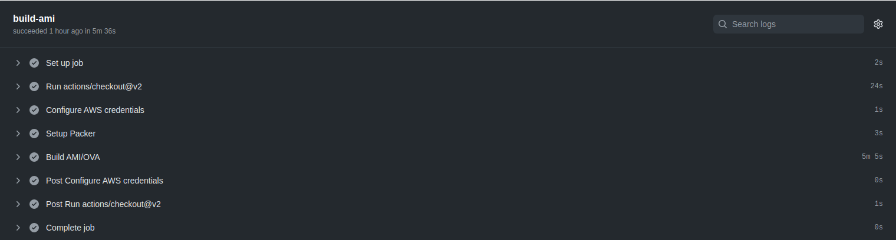
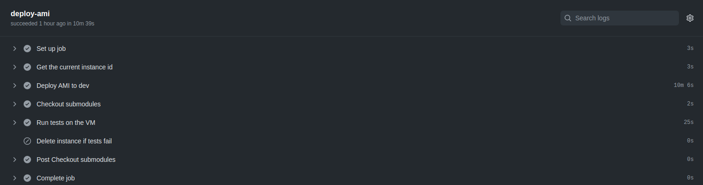

# GW-Releases

## Relevant Repos

- [k8-rebuild](https://github.com/k8-proxy/k8-rebuild/)
    - [k8-rebuild-rest-api](https://github.com/k8-proxy/k8-rebuild-rest-api)
        - [sdk-rebuild-eval](https://github.com/filetrust/sdk-rebuild-eval)
    - [k8-rebuild-file-drop](https://github.com/k8-proxy/k8-rebuild-file-drop)
- [vmware-scripts](https://github.com/k8-proxy/vmware-scripts)
- [icap-server](https://github.com/k8-proxy/icap-infrastructure)
- [proxy-server](https://github.com/k8-proxy/s-k8-proxy-rebuild)
- [load-balancer](https://github.com/k8-proxy/gp-load-balancer)
- [traffic-generator](https://github.com/k8-proxy/aws-jmeter-test-engine)
- [GW-proxy](https://github.com/k8-proxy/GW-proxy)

## Workflows (AWS)

### Workflows Brief
- GW-Releases work with 3 main workflows
    - [icap-server](https://github.com/k8-proxy/GW-Releases/actions?query=workflow%3Aicap-server)
    - [proxy-rebuild](https://github.com/k8-proxy/GW-Releases/actions?query=workflow%3Aproxy-rebuild)
    - [k8-rebuild](https://github.com/k8-proxy/GW-Releases/actions?query=workflow%3Ak8-rebuild)
- Each commit made to the main branch triggers the workflow, but the following directories are ignored:
    - aws-jmeter-test-engine
    - gp-load-balancer
    - GW-proxy
    - s-k8-proxy-rebuild
    - k8-rebuild
    - .github/workflows/k8-rebuild.yaml
- There are 2 main jobs for each workflow:
    - build-ami
        - Configure AWS credentials
        - Setup Packer
        - Build AMI 

    
    
    - deploy-ami
        - Get current instance ID
        - Deploy AMI to dev
        - Run tests on instance
        - Delete instance(s) that fail

    

### Workflow Requirements
    - icap-server
        - branch to use workflow from
        - AWS region(s) where AMI will be created
        - IP of monitoring server
    - proxy-rebuild
        - branch to use workflow from
        - ICAP server IP
        - AWS region(s) where AMI will be created
        - IP of monitoring server
    - k8-rebuild
        - branch to use workflow from

### ICAP Server Workflow
- [YAML File](https://github.com/k8-proxy/GW-Releases/blob/main/.github/workflows/icap-server.yaml) 
- build AMI
    - Configure AWS credentials
    - Setup [Packer](https://github.com/k8-proxy/vmware-scripts/tree/main/packer)
    - Build AMI using Packer 
- deploy AMI
    - Get current instance ID and other instance IDs with the same name as current instance
    - Deploy the instance
    - Run [healthcheck tests](https://github.com/k8-proxy/vmware-scripts/tree/f129ec357284c61206edf36415b1b2ba403bff95/HealthCheck) on the instance
        - if tests are successful for current instance, all previous instances are terminated
        - if tests are failed, current instance is terminated and deleted

### K8 Rebuild Workflow
- [YAML File](https://github.com/k8-proxy/GW-Releases/blob/main/.github/workflows/k8-rebuild.yaml)
- build AMI
    - Configure AWS credentials
    - Setup [Packer](https://github.com/k8-proxy/k8-rebuild/tree/f1ac7780d912daf033d3a801956dcb07b0164ac0/packer) 
- deploy AMI
    - Run [healthcheck tests](https://github.com/k8-proxy/vmware-scripts/tree/main/HealthFunctionalTests/filedrop) on the instance
        - if tests are successful for current instance, all previous instances are terminated
        - if tests are failed, current instance is terminated and deleted
### Proxy Rebuild Workflow
- [YAML File](https://github.com/k8-proxy/GW-Releases/blob/main/.github/workflows/proxy-rebuild.yaml)
- build AMI
    - Configure AWS credentials
    - Setup [Packer](https://github.com/k8-proxy/vmware-scripts/tree/main/packer)
    - Build AMI using Packer 
- deploy AMI
    - Get current instance ID and other instance IDs with the same name as current instance
    - Deploy the instance
    - Run tests on instance
        - Download this [PDF](https://glasswallsolutions.com/wp-content/uploads/2020/01/Glasswall-d-FIRST-Technology.pdf) file
        - Make sure it successfully has the watermark `"Glasswall Processed"`
            - if tests are successful for current instance, all previous instances are terminated
            - if tests are failed, current instance is terminated and deleted
